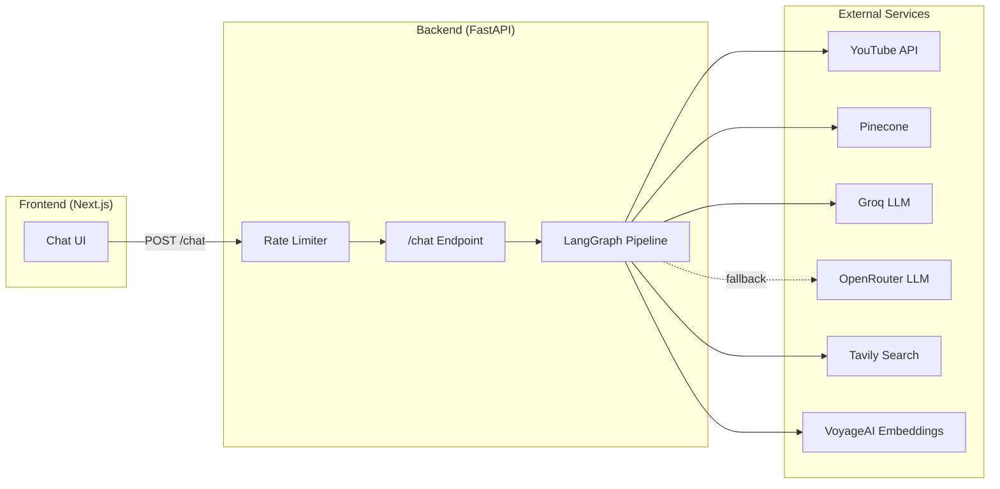
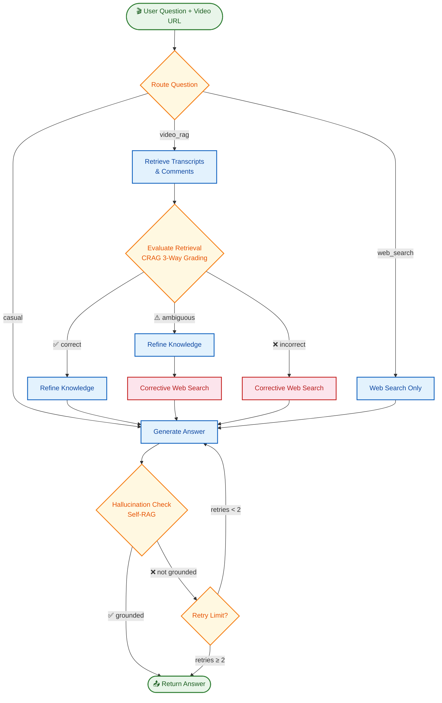

<p align="center">
  <h1 align="center">🎬 TubeTalk</h1>
  <p align="center">
    <strong>Chat with any YouTube video using an advanced AI-powered RAG pipeline</strong>
  </p>
  <p align="center">
    <a href="#-features">Features</a> •
    <a href="#-architecture">Architecture</a> •
    <a href="#-tech-stack">Tech Stack</a> •
    <a href="#-project-structure">Project Structure</a> •
    <a href="#-getting-started">Getting Started</a> •
    <a href="#-testing">Testing</a> •
    <a href="#-license">License</a>
  </p>
</p>

---

TubeTalk is a full-stack application that allows users to have natural conversations about any YouTube video. Paste a video URL, ask questions, and receive accurate, context-grounded answers powered by a **Hybrid Corrective RAG (CRAG) + Self-RAG** pipeline built with LangGraph.

The system automatically extracts video transcripts, metadata, and audience comments, indexes them in a Pinecone vector store, and uses a multi-stage AI pipeline to retrieve, evaluate, refine, and generate high-quality answers — with built-in hallucination detection.

## ✨ Features

| Feature | Description |
|---|---|
| 🗣️ **Video Chat** | Ask natural language questions about any YouTube video's content |
| 🧠 **Hybrid CRAG + Self-RAG** | Multi-stage pipeline that retrieves, evaluates, corrects, and self-checks answers |
| 📝 **Transcript Extraction** | Automatically extracts and indexes YouTube video transcripts |
| 💬 **Comment Analysis** | Scrapes top audience comments for sentiment and community reaction context |
| 🔍 **Web Search Fallback** | Automatically supplements answers with web search when video context is insufficient |
| 🛡️ **Hallucination Detection** | Self-RAG loop validates generated answers against source context |
| 🔑 **Dynamic API Keys** | Users can provide their own API keys via the Settings modal (BYOK) |
| ⚡ **Rate Limiting** | Backend protected with per-IP rate limiting (10 req/min) via slowapi |
| 📚 **Chat History** | Persistent chat history with search/filter across multiple videos |
| 🧪 **Test Suite** | Comprehensive pytest suite with mocked external services |

## 🏗️ Architecture

TubeTalk uses a **Hybrid Corrective RAG + Self-RAG** architecture powered by LangGraph. The pipeline intelligently routes questions, retrieves and evaluates context, and self-corrects hallucinated answers.

### High-Level System Architecture



### LangGraph Pipeline (CRAG + Self-RAG)



### Pipeline Stages Explained

| Stage | Type | Description |
|---|---|---|
| **Route Question** | Router | Classifies questions as `casual`, `video_rag`, or `web_search` using a fast LLM |
| **Retrieve** | CRAG | Fetches relevant transcript chunks from Pinecone vector store + video comments |
| **Evaluate Retrieval** | CRAG | Grades retrieval quality as `correct`, `ambiguous`, or `incorrect` |
| **Refine Knowledge** | CRAG | Decomposes retrieved chunks into strips, filters irrelevant ones, recomposes |
| **Corrective Web Search** | CRAG | Rewrites query and searches the web via Tavily when retrieval is weak |
| **Generate** | Generator | Reasoning LLM synthesizes the final answer from refined context |
| **Hallucination Check** | Self-RAG | Validates the answer is grounded in source context; retries if not (up to 2x) |

## 🛠️ Tech Stack

### Backend

| Technology | Purpose |
|---|---|
| **Python 3.12** | Core language |
| **FastAPI** | REST API framework |
| **LangGraph** | AI pipeline orchestration (stateful graph) |
| **LangChain** | LLM abstraction, prompt templates, output parsing |
| **Groq** (Llama 3.1 8B / Llama 3.3 70B) | Primary LLMs — fast inference |
| **OpenRouter** | Fallback LLMs — high availability |
| **VoyageAI** (voyage-3) | Text embeddings for semantic search |
| **Pinecone** | Serverless vector database |
| **Tavily** | Web search tool for corrective RAG |
| **yt-dlp** | YouTube metadata & comment extraction |
| **youtube-transcript-api** | YouTube transcript extraction |
| **slowapi** | API rate limiting (10 req/min per IP) |
| **pytest** | Unit & integration testing |

### Frontend

| Technology | Purpose |
|---|---|
| **Next.js 16** | React framework (App Router) |
| **React 19** | UI rendering |
| **TypeScript** | Type-safe frontend code |
| **Tailwind CSS 4** | Utility-first styling |
| **Framer Motion** | Smooth animations & transitions |
| **Lucide React** | Modern icon set |

## 📁 Project Structure

```
TubeTalk/
├── backend/                          # FastAPI + LangGraph backend
│   ├── app/
│   │   ├── __init__.py               # FastAPI app factory (CORS, rate limiter, middleware)
│   │   ├── config.py                 # Environment config, LLM instances, embeddings
│   │   ├── limiter.py                # slowapi Limiter instance
│   │   ├── models.py                 # Pydantic request/response schemas
│   │   ├── graph/
│   │   │   ├── state.py              # GraphState TypedDict definition
│   │   │   ├── nodes.py              # LangGraph node functions (route, retrieve, generate…)
│   │   │   ├── edges.py              # Conditional edge logic (CRAG & Self-RAG decisions)
│   │   │   └── builder.py            # Graph assembly & compilation
│   │   ├── routes/
│   │   │   └── chat.py               # POST /chat endpoint with rate limiting
│   │   └── services/
│   │       └── video.py              # YouTube transcript, metadata & comment extraction
│   ├── tests/
│   │   ├── conftest.py               # Pytest fixtures & mocked LLMs/services
│   │   ├── test_nodes.py             # Unit tests for each graph node
│   │   └── test_routes.py            # Integration tests for API routes
│   ├── main.py                       # Uvicorn entrypoint
│   └── requirements.txt              # Python dependencies
│
├── frontend/                         # Next.js frontend application
│   ├── src/
│   │   ├── app/
│   │   │   ├── layout.tsx            # Root layout with metadata
│   │   │   ├── page.tsx              # Main chat page (state, API calls, UI)
│   │   │   └── globals.css           # Global styles & design tokens
│   │   └── components/
│   │       ├── ChatHeader.tsx         # Video URL input & branding header
│   │       ├── ChatHistory.tsx        # Sidebar chat history with search/filter
│   │       ├── ChatInput.tsx          # Message input with quick actions
│   │       ├── ChatMessage.tsx        # Individual message bubble (user/bot)
│   │       ├── QuickActions.tsx       # Predefined question shortcuts
│   │       ├── SettingsModal.tsx      # API key configuration modal (BYOK)
│   │       ├── TubeTalkSidebar.tsx    # Collapsible sidebar wrapper
│   │       └── TypingIndicator.tsx    # Animated typing dots
│   ├── package.json
│   └── tsconfig.json
│
├── .gitignore
├── LICENSE                           # Apache 2.0
└── README.md                         # ← You are here
```

## 🚀 Getting Started

### Prerequisites

- **Python** 3.12+
- **Node.js** 18+
- **npm** or **pnpm**

### 1. Clone the Repository

```bash
git clone https://github.com/yourusername/TubeTalk.git
cd TubeTalk
```

### 2. Backend Setup

```bash
cd backend

# Create virtual environment
python -m venv .venv
source .venv/bin/activate       # Linux/macOS
# .venv\Scripts\activate        # Windows

# Install dependencies
pip install -r requirements.txt
```

Create a `.env` file in the `backend/` directory:

```env
GROQ_API_KEY=your_groq_api_key
OPENROUTER_API_KEY=your_openrouter_api_key
VOYAGE_API_KEY=your_voyageai_api_key
PINECONE_API_KEY=your_pinecone_api_key
PINECONE_INDEX_NAME=your_pinecone_index_name
TAVILY_API_KEY=your_tavily_api_key
```

Start the backend server:

```bash
uvicorn app:app --reload
```

The API will be available at `http://localhost:8000`.

### 3. Frontend Setup

```bash
cd frontend

# Install dependencies
npm install

# Start development server
npm run dev
```

The frontend will be available at `http://localhost:3000`.

### 4. Usage

1. Open the frontend at `http://localhost:3000`
2. Paste a YouTube video URL in the header
3. Ask questions about the video content
4. Use **Quick Actions** for common queries (summarize, key points, audience reactions)
5. Optionally configure your own API keys via the ⚙️ Settings modal

## 🧪 Testing

The backend includes a comprehensive pytest suite with mocked external services (no real API calls needed).

```bash
cd backend
source .venv/bin/activate

# Run all tests with verbose output
pytest -v tests/

# Run only node tests
pytest -v tests/test_nodes.py

# Run only route tests
pytest -v tests/test_routes.py
```

### Test Coverage

| Test File | Tests | What It Covers |
|---|---|---|
| `test_nodes.py` | 8 | All LangGraph nodes: routing, retrieval, evaluation, refinement, web search, generation, hallucination check |
| `test_routes.py` | 2 | API endpoint success & error handling, API key header overrides |

### Mocking Strategy

All external services are mocked in `conftest.py`:
- **LLMs** (Groq/OpenRouter) → Return predictable `AIMessage` objects
- **Pinecone** → Returns mock documents
- **Tavily** → Returns mock search results
- **YouTube** → Returns mock metadata & comments
- **Rate Limiter** → Disabled during testing

## 🔒 Security

- **Rate Limiting**: The `/chat` endpoint is protected by `slowapi` with a limit of 10 requests per minute per IP address. Exceeding this limit returns an HTTP `429 Too Many Requests` response.
- **Dynamic API Keys**: Users can optionally provide their own API keys via `X-Api-Key-*` HTTP headers. These keys are temporarily injected into the environment for the duration of the request only, then restored.
- **No Persistent Storage of Keys**: User-supplied API keys are never saved to disk or logged.

## 📄 License

This project is licensed under the **Apache License 2.0** — see the [LICENSE](LICENSE) file for details.
