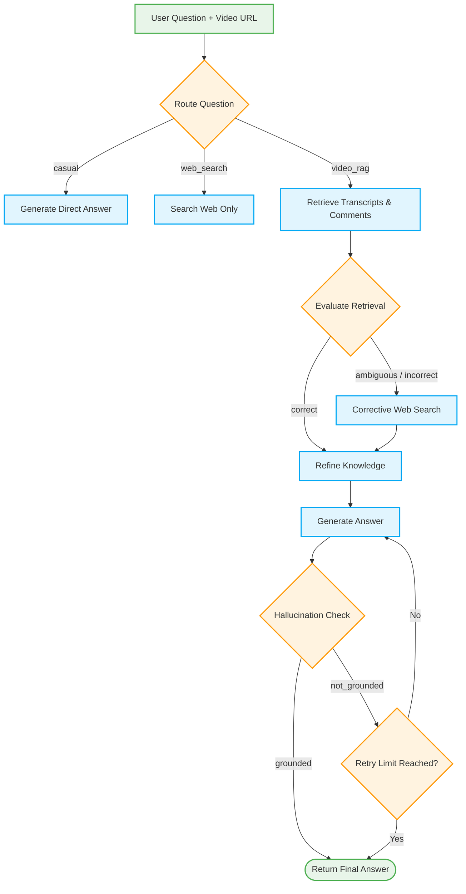

# TubeTalk Backend

TubeTalk Backend is a robust FastAPI and LangGraph-powered application that lets users "chat" with YouTube videos. It uses an advanced Hybrid RAG system consisting of **Corrective RAG (CRAG)** and **Self-RAG** to ensure accurate, context-aware, and hallucination-free answers based on a video's transcript, comments, and external web knowledge.

## Architecture

The AI workflow is powered by LangGraph, routing questions and refining context before generating an answer.



### The CRAG + Self-RAG Pipeline Explained:
1. **Routing:** The question is routed to a casual chat, web search, or video context pipeline.
2. **Retrieval & CRAG (Corrective RAG):** The video's transcripts and audience comments are retrieved from a Pinecone vector store. A fast LLM grades the retrieved context. If it's ambiguous or incorrect, a Corrective Web Search (via Tavily) is executed to gather supplementary facts.
3. **Refinement:** The context is filtered and re-organized for maximum relevance.
4. **Generation & Self-RAG:** A powerful reasoning LLM generates an answer. Self-RAG evaluates this generated answer against the context. If hallucinations are detected, generation is re-attempted.

## Features
- **YouTube Extraction:** Bypasses JavaScript runtimes using native Engagement Panel parsing to extract metadata and comments reliably.
- **Dynamic API Keys:** Allows frontend users to override default `.env` API keys dynamically via `X-Api-Key-*` HTTP headers.
- **Rate Limiting:** Protects the FastAPI endpoints via `slowapi` (configured by default to `10 requests/minute`).
- **Full Test Coverage:** Tested using `pytest` and extensive Mocking of all external APIs (Groq, OpenRouter, Pinecone, Tavily, YouTube).

## Setup & Running Locally

1. Create a virtual environment and install dependencies:
   ```bash
   python -m venv .venv
   source .venv/bin/activate
   pip install -r requirements.txt
   ```

2. Run the application:
   ```bash
   uvicorn app:app --reload
   ```

3. Run the test suite:
   ```bash
   pytest -v tests/
   ```
